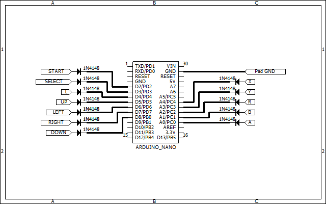
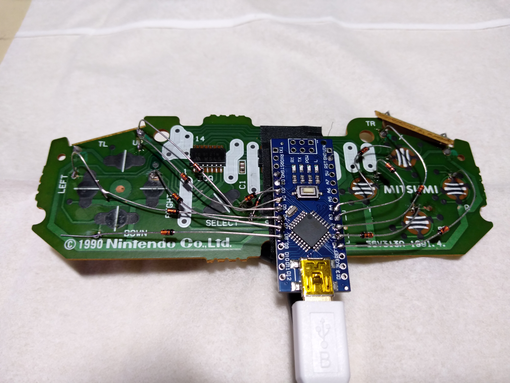

# snes_control_from_pc
SNES control from pc.  

amazonで安く売っているarduino nano を使用し、PCから手軽にスーパーファミコン操作することを目標に作っています。  

circuit_snes       : コントローラー乗っ取り用回路図  
ClassLibraryForPC  : Windows用テストプログラム(visual studio)  
sketch_snes        : arduino nano用のテストプログラム  
  
  
## テストプログラムの動作  

テストプログラム動作の様子  
https://youtu.be/H7-xR-DRq8Y  
  
  
## 回路図  

  
  
  
## 実装例  

  
  
  
